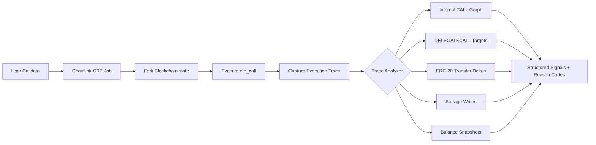
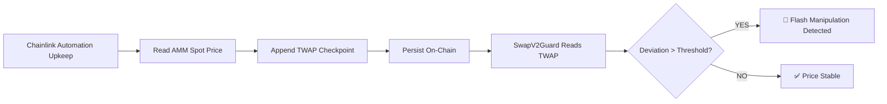
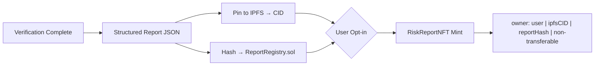

<div align="center">


**Zero-Trust Pre-Transaction Firewall for DeFi**

*Verify before you execute. Trust nothing. Simulate everything.*

<br/>

[](https://arbitrum.io)
[](https://chain.link)
[](https://automation.chain.link)
[](https://soliditylang.org)
[](https://book.getfoundry.sh)
[](LICENSE)

<br/>

> Built for the **DeFi Infrastructure** — using Chainlink CRE for off-chain fork simulation and Chainlink Automation for real-time TWAP maintenance.

</div>

---

## Table of Contents

- [What is PreFlight?](#what-is-preflight)
- [The Problem](#the-problem)
- [Core Abstraction](#core-abstraction)
- [How It Works](#how-it-works)
- [Architecture](#architecture)
- [System Layers](#system-layers)
- [Chainlink Integration](#chainlink-integration)
- [Security Modules](#️security-modules)
- [Design Principles](#design-principles)
- [Getting Started](#getting-started)
- [License](#license)

---

## What is PreFlight?

**PreFlight is a transaction-level integrity firewall that runs before your DeFi transaction executes.**

It is not a price oracle, or a monitoring dashboard. It is a **pre-execution verifier**: given exact calldata, exact block state, and exact user intent — it tells you whether that transaction is safe to submit. Every decision is explainable, reproducible, and backed by on-chain evidence.

Unlike price previews or slippage warnings, PreFlight:

- Executes the inbuilt on-chain guards
- Simulates the exact calldata
- Analyzes the execution trace
- Verifies accounting invariants
- Detects manipulation patterns
- Enforces explainable security policy
```js
[ User Signs Intent ] ──► [ PreFlight Verification ] ──► [ Execute transaction ]
                                      ↕
                            CRE Simulations(forked Environment)
                            + on-chain guards
                            + Risk policies
                            + mint nft 
                    
```

---

## The Problem

Users lose funds even when:

- UI preview looks correct  
- Slippage is reasonable  
- Protocol is audited  
- MEV protection is enabled  

Because:
- Flash-loan manipulation distorts state  
- Routers use hidden delegatecalls  
- Vault exchange rates are manipulated  
- Internal calls redirect funds
- Runtime state manipulation

** Existing tools only check math — not execution**  
***PreFlight checks execution integrity.***

PreFlight fills this gap. It operates between **sign** and **execute** — the only window these tools leave unguarded.

```js
[ Sign Transaction ] → [ PreFlight Verification ] → [ Execute ]
```

---

## Core Abstraction

A transaction is safe **if and only if**:

> *The observable on-chain state, execution trace, and accounting invariants match the user's intent within defined risk bounds.*

PreFlight enforces this across three independent layers:

| Layer | What It Verifies | How |
|---|---|---|
| **State Integrity** | On-chain state is not manipulated | Deterministic `view`-only Guard contracts |
| **Execution Integrity** | What *will* happen when the tx runs | Chainlink CRE forks Arbitrum and simulates |
| **Accounting Integrity** | Balance deltas match intent | Trace analysis + invariant math |

---

## How It Works

PreFlight enforces **transaction-level integrity verification** through a deterministic, multi-stage pipeline executed *before* on-chain submission.

### Execution Flow

```text
User Intent (Browser Extension Intercepts)
        │
        ▼
[1] Off-Chain Simulation — Chainlink CRE
        • Fork Blockchain Environment at current block
        • Execute exact calldata in sandbox
        • Capture full execution trace
        • Compute balance deltas & state transitions
        │
        ▼
[2] On-Chain Guards (via PreFlightRouter)
        • SwapV2Guard     — TWAP deviation, reserves, pricing integrity
        • LiquidityGuard  — pool health, LP safety
        • VaultGuard      — ERC-4626 invariants, exchange rate correctness
        • TokenGuard      — ERC-20 safety (multi-point validation)
        │
        ▼
[3] Risk Policy (on-chain aggregation)
        • Combines:
            - Off-chain trace signals (CRE)
            - On-chain guard flags
        • Evaluates:
            - BPS-based thresholds
            - Oracle freshness / staleness
            - Sweep magnitude / value extraction
        • Detects compound risk patterns
        • Produces: INFO / WARNING / MEDIUM / CRITICAL
        │
        ▼
[4] RiskReportNFT (on-chain evidence)
        • Full structured report minted as NFT
        • User reviews risk classification
        │
        ▼
[5] User Decision → Execute or Abort
        • If confirmed → routed via guarded executors
        • If rejected → transaction never reaches execution
```

---

###  Execution Ordering

* **Simulation runs first** (via Chainlink CRE)
  → ensures execution trace signals are available

* **On-chain guards run next** as cheap `view` calls
  → zero gas, real-time state validation

* **Risk scoring is fully on-chain** in `RiskPolicy.sol`
  → deterministic, reproducible, and transparent

---

###  What Gets Verified

PreFlight evaluates three independent dimensions:

* **State Integrity** → Is current on-chain state trustworthy?
* **Execution Integrity** → What will actually happen when executed?
* **Accounting Integrity** → Do resulting balance changes match intent?

A failure in *any* dimension flags the transaction as risky.

---

## Architecture

PreFlight follows a **modular, separation-of-concerns architecture**, where each component is isolated and composable.

```text
Browser Extension (Tx Interception)
        │
        ▼
Chainlink CRE (Off-Chain Simulation)
        │
        │  → OffChainSimResult (structured output)
        ▼
PreFlightRouter.sol
        │
        ├─ SwapV2Guard.sol      (TWAP, reserve integrity)
        ├─ LiquidityGuard.sol   (LP safety, pool checks)
        ├─ VaultGuard.sol       (ERC-4626 invariants)
        ├─ TokenGuard.sol       (token-level validation)
        │
        ▼
RiskPolicy.sol
        • Aggregates all signals (off-chain + on-chain)
        • Tiered scoring (BPS gradients, oracle age, sweep magnitude)
        • Detects compound risk combinations
        │
        ▼
RiskReportNFT.sol
        • Fully on-chain SVG report
        • Risk meter + flag breakdown + scoring
        • Lifecycle: PENDING → CONSUMED | EXPIRED
        │
        ▼
Executor Contracts (Non-upgradeable)
        • SwapV2Executor.sol
        • VaultExecutor.sol
        • LiquidityV2Executor.sol
```

---

### Contract Design

* **Guards & Router**

  * Implemented as UUPS upgradeable proxies
  * Allow extensibility without breaking core flow

* **Executors**

  * Stateless, non-upgradeable contracts
  * Minimal attack surface
  * Strictly responsible for final execution

* **Policy Engine**

  * Fully on-chain
  * Deterministic aggregation of all signals

---

## System Layers

```text
┌──────────────────────────┐
│        Frontend          │
│  - Intent Builder        │
│  - Risk Visualization    │
│  - User Decision Layer   │
└─────────────┬────────────┘
              │
┌─────────────▼────────────┐
│     Chainlink CRE        │
│  - Fork block            │
│  - Execute calldata      │
│  - Capture trace         │
│  - Compute deltas        │
└─────────────┬────────────┘
              │
┌─────────────▼────────────┐
│     PreFlightRouter      │
│  - Orchestration Layer   │
│  - Routes verification   │
└─────────────┬────────────┘
              │
┌─────────────▼────────────┐
│    On-Chain Guards       │
│  - SwapV2Guard           │
│  - LiquidityGuard        │
│  - VaultGuard            │
│  - TokenGuard            │
└─────────────┬────────────┘
              │
┌─────────────▼────────────┐
│      RiskPolicy.sol      │
│  - Signal aggregation    │
│  - Severity scoring      │
│  - Decision logic        │
└─────────────┬────────────┘
              │
┌─────────────▼────────────┐
│     RiskReportNFT        │
│  - On-chain evidence     │
│  - Verifiable report     │
└─────────────┬────────────┘
              │
        Execute / Abort
```

---

### Key Design Guarantees

* **Deterministic Results**
  Same calldata + same state → identical risk output

* **Full Transparency**
  Every risk is explainable and trace-backed

* **Zero Blind Trust**
  Neither UI, nor protocol, nor state is assumed safe

* **Pre-Execution Enforcement Point**
  Verification occurs before irreversible commitment

---

## Chainlink Integration

PreFlight’s execution-aware verification pipeline is powered by **Chainlink infrastructure**, enabling deterministic simulation and trust-minimized state validation.

PreFlight is designed to be **protocol-agnostic**:

* Supports **all AMMs (DEXs)** on Arbitrum
* Supports **ERC-4626 vaults and yield protocols**
* Operates universally through the **browser extension interception layer**

Chainlink enables PreFlight to perform **deep execution analysis without relying on centralized infrastructure**.

---

### Chainlink CRE — Deterministic Off-Chain Simulation



Chainlink CRE provides:

* **Fork-based execution simulation** using live chain state
* **Exact calldata replay** (no approximation)
* **Full EVM trace capture**
* **Structured signal extraction for policy evaluation**

### Key Properties

* **Deterministic** → Same input produces identical output
* **Attestable** → Results can be referenced in on-chain decisions
* **Trust-minimized** → No centralized simulation backend
* **Composable** → Outputs directly feed into on-chain policy engine

All simulation outputs are encoded into structured signals and passed to `RiskPolicy.sol`, and can be embedded into NFT metadata for full auditability.

---

### Chainlink Automation — Real-Time TWAP Integrity

PreFlight uses Chainlink Automation to maintain **reliable TWAP checkpoints**, critical for detecting price manipulation.



### Why This Matters

Flash-loan attacks rely on **temporary price distortion**.

TWAP validation ensures:

* Spot price is compared against **historical consensus**
* Manipulated states are detected **before execution**

### Properties

* Fully **on-chain maintained**
* No reliance on centralized keepers
* Configurable per pool (interval + sensitivity)
* Directly integrated into `SwapV2Guard`

---

## Security Modules

PreFlight enforces **protocol-specific invariants** across core DeFi actions.

Each module defines:

* threat model
* invariants
* abort conditions

---

### SwapV2Guard

Protects AMM swap interactions.

| Check                        | Layer                     | Abort Condition                           |
| ---------------------------- | ------------------------- | ----------------------------------------- |
| Canonical router validation  | On-chain                  | Router not whitelisted → **CRITICAL**     |
| Spot vs TWAP deviation       | On-chain (Automation-fed) | >1% stable / >5% volatile → **BLOCK**     |
| Reserve delta anomaly        | On-chain                  | >10% change → **Flash loan suspicion**    |
| Minimum liquidity check      | On-chain                  | TVL < threshold + large trade → **BLOCK** |
| Token mintability            | On-chain                  | Owner-mintable → **WARNING**              |
| Simulated vs expected output | CRE                       | Below slippage threshold → **BLOCK**      |
| Fee-on-transfer detection    | CRE Trace                 | Output mismatch → **HIGH RISK**           |
| Third-party transfers        | CRE Trace                 | Unexpected recipient → **CRITICAL**       |
| Delegatecall to unknown      | CRE Trace                 | Unknown target → **CRITICAL**             |

---

### LiquidityV2Guard

Protects liquidity provisioning and withdrawal flows.

| Check                     | Layer      | Abort Condition                           |
| ------------------------- | ---------- | ----------------------------------------- |
| Token mintability         | On-chain   | Owner-controlled mint → **WARNING**       |
| Pair age validation       | On-chain   | < threshold blocks → **WARNING**          |
| Canonical router check    | On-chain   | Not whitelisted → **CRITICAL**            |
| Approval flow correctness | CRE Trace  | Unexpected spender → **CRITICAL**         |
| LP mint destination       | Simulation | Minted to unknown address → **HIGH RISK** |
| Add liquidity correctness | CRE        | Assets not credited → **BLOCK**           |
| LP transfer restrictions  | On-chain   | Honeypot detected → **WARNING**           |
| Withdrawal call safety    | CRE Trace  | Arbitrary external calls → **CRITICAL**   |

---

### ERC4626VaultGuard (ERC-4626)

Protects vault deposits, withdrawals, and share accounting.

| Check                         | Layer     | Abort Condition                                  |
| ----------------------------- | --------- | ------------------------------------------------ |
| Exchange rate deviation       | On-chain  | >2% warn / >10% block                            |
| Asset accounting mismatch     | On-chain  | `balanceOf ≠ totalAssets` → **CRITICAL**         |
| Total asset anomaly           | On-chain  | Sudden jump without supply change → **CRITICAL** |
| Admin hook execution          | CRE Trace | Privileged logic triggered → **CRITICAL**        |
| Delegatecall in withdraw path | CRE Trace | External execution → **CRITICAL**                |
| Simulated share output        | CRE       | Shares < expected → **BLOCK**                    |
| Reentrancy patterns           | CRE Trace | Mid-flow balance mutation → **CRITICAL**         |

---

### Risk Reports & Soulbound NFT

Every verification can produce a **non-transferable, on-chain risk report**.



#### Properties

* **One NFT per verification**
* **Non-transferable (Soulbound)**
* Contains:

  * full execution trace
  * reason codes
  * risk classification
  * reproducibility metadata

This enables:

* independent verification
* audit reproducibility
* transparent decision justification

---

## Design Principles

PreFlight is built with strict engineering principles:

### Determinism

* Same input → same output
* No probabilistic scoring

### Explainability

* Every decision maps to explicit reason codes
* No opaque heuristics

### Minimal Trust Assumptions

* Simulation via Chainlink CRE
* State validation via on-chain guards

### Modularity

* New protocols → new adapters
* New checks → new guard functions
* Core system remains unchanged

### Separation of Concerns

* Simulation (off-chain)
* Validation (on-chain)
* Aggregation (policy layer)

---

## Getting Started
```bash
# Clone and install
git clone https://github.com/Sourav-IIITBPL/preflight && cd preflight/contracts
forge install

# Run unit tests
forge test --match-path "test/unit/*" -vv
```
---

## Project Status — Under Active Development

> ⚠️ Note: The browser extension and Chainlink CRE simulation components are currently housed in a private repository (`preflight-private`) as they undergo finalization and hardening.  
> This repository contains the full smart contract suite, frontend, and end-to-end architectural design.


## License

MIT © PreFlight Contributors


<div align="center">

**Built with 🔗 Chainlink CRE · Chainlink Automation · Foundry**

*PreFlight — Trust the math, not the preview.*

</div>


