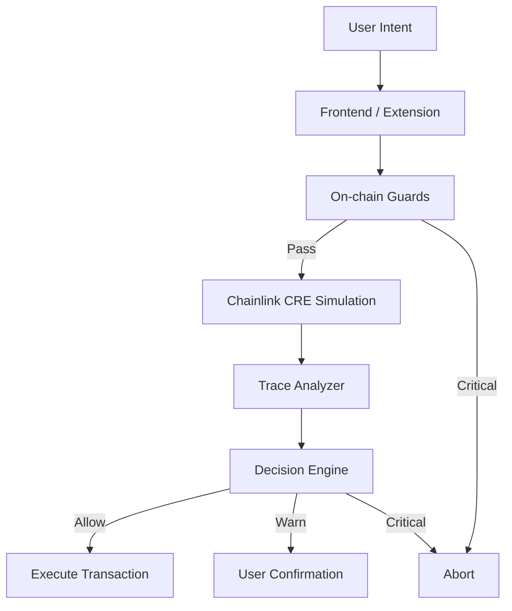

<div align="center">

# 🛡️ PreFlight

### Zero-Trust Pre-Transaction Firewall for Arbitrum DeFi

*Verify before you execute. Trust nothing. Simulate everything.*

<br/>

[](https://arbitrum.io)
[](https://chain.link)
[](https://automation.chain.link)
[](https://soliditylang.org)
[](https://book.getfoundry.sh)
[](LICENSE)

<br/>

> **Built for the Arbitrum** — leveraging Chainlink CRE for off-chain transaction simulation and Chainlink Automation for real-time TWAP oracle maintenance.

</div>

---

## 📖 Table of Contents

- [What is PreFlight?](#-what-is-preflight)
- [The Problem](#-the-problem)
- [How It Works](#-how-it-works)
- [Chainlink Integration](#-chainlink-integration)
- [Architecture](#-architecture)
- [Security Modules](#-security-modules)
- [Threat Coverage](#-threat-coverage)
- [Risk Reports & NFT](#-risk-reports--nft)
- [Folder Structure](#-folder-structure)
- [Getting Started](#-getting-started)

---


## 🔍 What is PreFlight?

**PreFlight is a transaction-level integrity firewall that runs before your DeFi transaction executes.**

It is not:
- ❌ A price oracle
- ❌ A monitoring dashboard
- ❌ A generic "risk score" app
- ❌ A replacement for audits

It is:
- ✅ A **pre-execution verifier** — checks the specific transaction at the specific block
- ✅ A **multi-layer analysis engine** — on-chain guards + Chainlink CRE simulation + trace analysis
- ✅ An **invariant enforcer** — confirms that what should happen, will happen
- ✅ An **explainable firewall** — every block or warning has a reason code, not a black-box score

```
[ User Signs Intent ]
        ↓
[ PreFlight Verification Layer ]   ←— This is what we build
        ↓
[ Execute Transaction ]
```

---

## ⚠️ The Problem

Users lose funds even when:

| ✅ Looks Safe | ❌ Still Gets Exploited Because... |
|---|---|
| UI price preview looks correct | Flash loan manipulated reserves this block |
| Slippage is set reasonably | Malicious internal transfers bypass slippage |
| Protocol is audited | Runtime state manipulation, not code bugs |
| MEV protection is enabled | Malicious logic is *inside* the transaction |
| Router address looks canonical | Phishing router with hidden delegatecall |

### Why Price Previews & Slippage Are Insufficient

| Tool | What It Checks | What It Misses |
|---|---|---|
| Price Preview | Static quote from current reserves | Whether reserves were flash-manipulated |
| Slippage Setting | User-defined output tolerance | Malicious internal transfers, taxes, hidden drains |
| UI Trust | Hardcoded router address | Phishing / malicious router |
| Audit | Code correctness in isolation | Runtime state manipulation |
| MEV Protection | Transaction ordering | Malicious logic inside the tx |

**PreFlight sits between "sign" and "execute" — the only gap these tools leave open.**

---

## ⚙️ How It Works

### End-to-End Flow

```
┌─────────────────────────────────────────────────────────────┐
│                      USER INTENT                            │
│          (swap / add liquidity / remove / vault)            │
└──────────────────────────┬──────────────────────────────────┘
                           │
                           ▼
┌─────────────────────────────────────────────────────────────┐
│               LAYER 1: ON-CHAIN GUARDS                      │
│         SwapGuard · LiquidityGuard · VaultGuard             │
│                                                             │
│  • Canonical router check          • TWAP deviation check   │
│  • Reserve delta analysis          • Token mintability       │
│  • Minimum liquidity threshold     • Exchange rate spike     │
│                                                             │
│  Result: PASS ──────────────────────────────────────────┐  │
│          CRITICAL → ❌ ABORT (Router Reverts)            │  │
│          WARN → continue to Layer 2 ──────────────────┐ │  │
└──────────────────────────────────────────────────────│─│──┘
                                                       │ │
                           ┌───────────────────────────┘ │
                           ▼                             │
┌─────────────────────────────────────────────────────────────┐
│           LAYER 2: CHAINLINK CRE SIMULATION                 │
│           (Off-chain Execution Environment)                 │
│                                                             │
│  • Fork Arbitrum at current block                           │
│  • Execute exact calldata via eth_call                      │
│  • Capture full execution trace                             │
│  • Inspect: delegatecalls · balance deltas · events         │
│                                                             │
│  Result: Reason Stack + Safety Score (0–100)                │
└──────────────────────────┬──────────────────────────────────┘
                           │
                           ▼
┌─────────────────────────────────────────────────────────────┐
│              LAYER 3: DECISION ENGINE                       │
│                                                             │
│    CRITICAL  →  ❌ Abort (no override)                      │
│    ≥2 WARN   →  ⚠️  Hard confirmation required              │
│    1 WARN    →  🟡 User confirmation                        │
│    INFO only →  ✅ Allow                                    │
└──────────────────────────┬──────────────────────────────────┘
                           │
              ┌────────────┴────────────┐
              ▼                         ▼
     ✅ EXECUTE                   ❌ BLOCKED
  (via PreFlightRouter)       (with reason codes)
```

### Three Integrity Layers

| Layer | What It Verifies | How |
|---|---|---|
| **State Integrity** | On-chain state matches expectations | Deterministic view calls via Guard contracts |
| **Execution Integrity** | What *will* happen when the tx runs | Chainlink CRE forks Arbitrum and simulates |
| **Accounting Integrity** | Balance deltas match the user's intent | Trace analysis + invariant math |

---

## 🔗 Chainlink Integration

PreFlight is deeply integrated with two core Chainlink services:

### 1. Chainlink CRE — Off-Chain Transaction Simulation

> **The heart of PreFlight's deep analysis layer.**

Chainlink CRE (Compute Runtime Environment) powers the off-chain simulation pipeline:

```
User submits intent
        │
        ▼
Chainlink CRE Job triggered
        │
        ├── Fork Arbitrum at target block
        ├── Execute transaction calldata (eth_call)
        ├── Capture full execution trace
        │     ├── Internal CALL / DELEGATECALL graph
        │     ├── ERC-20 transfer events
        │     ├── Storage write deltas
        │     └── Balance snapshots pre/post
        │
        └── Return: { safetyScore, reasonCodes[], traceJSON, reproScript }
```

**Why CRE for simulation?**
- Trustless, verifiable computation — not a centralized backend
- Arbitrum-aware execution environment
- Results can be attested and referenced in on-chain decisions
- Enables reproducible evidence for NFT reports

---

### 2. Chainlink Automation — TWAP Oracle Maintenance

> **Ensures TWAP data is fresh for every guard check.**

```
┌──────────────────────────────────────────────────────────┐
│              Chainlink Automation Upkeep                 │
│                                                          │
│  Every N blocks (configurable per pool):                 │
│    1. Read current spot price from AMM                   │
│    2. Accumulate into TWAP checkpoints array             │
│    3. Write checkpoint to TWAP storage                   │
│    4. Emit TWAPUpdated(pool, price, timestamp)           │
│                                                          │
│  SwapGuard.spotVsTwap() reads these checkpoints          │
│  to detect flash-loan price manipulation.                │
└──────────────────────────────────────────────────────────┘
```

**Why Automation for TWAP?**
- Periodic on-chain TWAP snapshots require reliable, trust-minimized upkeep
- Chainlink Automation guarantees execution without a centralized cron job
- Guards remain fully deterministic and auditable — they read from Automation-maintained state

---

## 🏗️ Architecture

### Contract Layer

```
contracts/
├── PreFlightRouter.sol          ← Orchestrator: routes intents, enforces guards
├── ProtocolRegistry.sol         ← Canonical whitelist of trusted routers/vaults/AMMs
├── Policy.sol                   ← Threshold configuration (governance-upgradable)
│
├── src/guards/
│   ├── SwapGuard/
│   │   └── SwapV2Guard.sol      ← Spot/TWAP, reserves, liquidity, token checks
│   ├── LiquidityGuard.sol       ← Mintability, pair age, LP routing checks
│   ├── TokenGuard.sol           ← Token-level: mint, pause, decimals, age
│   └── VaultGuard.sol           ← ERC-4626: exchange rate, inflation, reentrancy
│
├── interfaces/                  ← Shared interfaces for guards and adapters
│
└── reports/
    └── RiskReportNFT.sol        ← Soulbound NFT: one per scan, IPFS-linked report
```

### Backend Layer (Node.js / TypeScript)

```
backend/
├── simulateTx.js        ← Chainlink CRE job trigger + trace collection
├── traceAnalyzer.js     ← Delegatecall, balance delta, reentrancy pattern detection
├── decisionEngine.js    ← Reason code aggregation + policy evaluation
├── reportStore.js       ← IPFS pinning + ReportRegistry interaction
└── server.js            ← REST API gateway
```

### API Endpoints

| Method | Endpoint | Purpose |
|---|---|---|
| `GET` | `/api/guards/:action` | Quick on-chain view check result |
| `POST` | `/api/simulate` | Trigger Chainlink CRE simulation, return full report |
| `POST` | `/api/report` | Pin report to IPFS, return CID |
| `POST` | `/api/mint` | Mint SBT NFT with report CID |
| `GET` | `/api/registry` | Fetch trusted address list |
| `POST` | `/api/feedback` | Submit false-positive feedback |

---

## 🔐 Security Modules

### SwapGuard — `SwapV2Guard.sol`

Protects swap actions against flash-loan manipulation, sandwich attacks, and malicious routers.

| Check | Layer | Trigger Condition |
|---|---|---|
| `isCanonicalRouter` | On-chain | Router not in registry → CRITICAL |
| `spotVsTwap` | On-chain (Automation-fed) | Stable: >1% / Major: >5% → BLOCK |
| `reserveDeltaSinceLastBlock` | On-chain | >10% reserve change → flash loan likely |
| `minLiquidityCheck` | On-chain | TVL < $20k and trade > 1% TVL → BLOCK |
| `tokenHasMintOrOwner` | On-chain | Mintable token detected → WARN |
| `tokenDecimalsCheck` | On-chain | Decimal mismatch → WARN |
| Simulated vs quoted output | CRE Simulation | Output < quoted × (1 − slippage) → BLOCK |
| Tax/fee-on-transfer | CRE Trace | Received < quoted → HIGH RISK |
| Third-party transfer | CRE Trace | Funds routed to unknown address → CRITICAL |
| Sandwich/MEV heuristic | Backend | Suspicious mempool activity → WARN |

---

### LiquidityGuard — `LiquidityGuard.sol`

Protects add/remove liquidity from rug traps, honeypots, and LP redirection attacks.

| Check | Layer | Trigger Condition |
|---|---|---|
| `tokenMintableCheck` | On-chain | Owner can mint → WARN |
| `pairCreationAge` | On-chain | Pair < 1000 blocks old → WARN |
| `isRouterCanonical` | On-chain | Non-whitelisted router → CRITICAL |
| `approvalFlowCheck` | CRE Trace | Approval to unexpected address → CRITICAL |
| `mintEventInBlock` | Backend | LP minted to unknown address same block → HIGH |
| Simulate add correctness | CRE Simulation | Token not credited to user → BLOCK |
| Token transfer hook trap | CRE Trace | Revert/balance manipulation in hook → BLOCK |
| `lpShareOwnershipCheck` | On-chain | LP transfer restricted → WARN |
| Withdrawal external calls | CRE Trace | Arbitrary call during exit → CRITICAL |

---

### VaultGuard — `VaultGuard.sol`

Protects ERC-4626 vault deposit/withdraw from donation attacks, inflation exploits, and admin hooks.

| Check | Layer | Trigger Condition |
|---|---|---|
| `exchangeRateCheck` | On-chain | Rate spike >2% WARN, >10% BLOCK |
| `assetsBalanceMismatch` | On-chain | `balanceOf(vault)` ≠ `totalAssets()` → CRITICAL |
| `totalAssetsJumpDetect` | On-chain | Assets jump without supply change → HIGH |
| `isVaultVerified` | Backend | Unverified source → HIGH |
| `vaultCallsExternalAdmin` | CRE Trace | Admin hook fires on deposit/withdraw → CRITICAL |
| `withdrawAllPathSafety` | CRE Trace | Delegatecall during withdraw → CRITICAL |
| Simulate deposit shares | CRE Simulation | Shares received < expected → BLOCK |
| Simulate withdraw assets | CRE Simulation | Assets returned < expected → BLOCK |
| Reentrancy pattern | CRE Trace | Balance modified mid-flow recursively → CRITICAL |

---

### TokenGuard — `TokenGuard.sol`

Cross-cutting token-level checks applied to all four action types.

| Check | Layer | Trigger |
|---|---|---|
| Token age < 7 days | Backend | WARN |
| Owner concentration (top 3 > 40%) | Backend | WARN |
| Mintable / pausable / blacklist | On-chain | WARN |
| Fee-on-transfer simulation | CRE | HIGH RISK |
| Decimal mismatch | On-chain | WARN |

---

## 🧠 Decision Engine

Every check emits a structured signal:

```json
{
  "code": "R002",
  "label": "TWAP_DEV_EXCEEDS_THRESHOLD",
  "severity": "CRITICAL",
  "confidence": 0.97,
  "details": "Spot price deviated 8.3% from 10-min TWAP. Flash manipulation likely."
}
```

### Reason Codes (Canonical)

| Code | Label | Severity |
|---|---|---|
| R001 | NON_CANONICAL_ROUTER | CRITICAL |
| R002 | TWAP_DEV_EXCEEDS_THRESHOLD | CRITICAL |
| R003 | RESERVE_DELTA_FLASH_LOAN_LIKELY | HIGH |
| R004 | TOKEN_MINTABLE_DETECTED | WARN |
| R005 | TOKEN_OWNER_HIGH_CONCENTRATION | WARN |
| R006 | CONTRACT_UNVERIFIED | HIGH |
| R007 | DELEGATECALL_TO_UNKNOWN | CRITICAL |
| R008 | SELFDESTRUCT_OCCURRED | CRITICAL |
| R009 | TRANSFER_TO_THIRD_PARTY | CRITICAL |
| R010 | EXCHANGE_RATE_SPIKE_DETECTED | CRITICAL |
| R011 | FEE_ON_TRANSFER_DETECTED | HIGH |
| R012 | ASSETS_BALANCE_MISMATCH | CRITICAL |
| R013 | LP_MINTED_TO_UNKNOWN | HIGH |
| R014 | REENTRANCY_PATTERN | CRITICAL |
| R015 | TOKEN_AGE_TOO_YOUNG | WARN |
| R016 | ADMIN_HOOK_ON_DEPOSIT | CRITICAL |

### Abort Policy

```
┌────────────────────────────────────────────┐
│            DECISION MATRIX                 │
│                                            │
│  Any CRITICAL signal  →  ❌ Hard Abort     │
│                            (no override)   │
│                                            │
│  ≥ 2 WARN signals     →  ⚠️  Abort or     │
│                            multi-step      │
│                            confirmation    │
│                                            │
│  1 WARN signal        →  🟡 User must      │
│                            confirm         │
│                                            │
│  INFO signals only    →  ✅ Allow          │
│                                            │
│  No magic scores. Every decision has       │
│  a reason code and human explanation.      │
└────────────────────────────────────────────┘
```

---

## 🧾 Risk Reports & NFT

### Single SBT Per Scan

Every time a user runs a PreFlight scan, **one Soulbound NFT can be minted** as immutable proof of the analysis — only with explicit user consent.

```
User runs scan
      │
      ▼
Chainlink CRE produces report JSON
      │
      ├── Report pinned to IPFS
      ├── SHA-256 hash stored on ReportRegistry.sol
      │
      └── User clicks "Mint Proof"
              │
              ▼
        RiskReportNFT.sol
        ┌───────────────────────────────┐
        │  tokenId: auto-incremented    │
        │  owner: msg.sender            │
        │  ipfsCID: "Qm..."             │
        │  reportHash: bytes32          │
        │  timestamp: block.timestamp   │
        │  transferable: false (SBT)    │
        └───────────────────────────────┘
```

### Why Soulbound?

| Property | Benefit |
|---|---|
| Non-transferable | Report is tied to the wallet that scanned — it cannot be bought or sold |
| IPFS-linked | Full trace, reason codes, repro script — all immutable |
| On-chain hash | Tamper-proof: any modification to the report is detectable |
| Consent-gated | Never minted without explicit user action |
| One per scan | Clean audit trail — not gameable |

### NFT Metadata Schema

```json
{
  "name": "PreFlight Scan Report #1042",
  "description": "Pre-transaction security scan for Arbitrum DeFi action",
  "attributes": [
    { "trait_type": "Action", "value": "Swap" },
    { "trait_type": "Safety Score", "value": 34 },
    { "trait_type": "Verdict", "value": "BLOCKED" },
    { "trait_type": "Risk Codes", "value": "R002, R003" },
    { "trait_type": "Block Number", "value": 187203847 },
    { "trait_type": "Chain", "value": "Arbitrum One" }
  ],
  "report_cid": "QmXyz...",
  "report_hash": "0xabc123..."
}
```

---

## 📁 Folder Structure

```
preflight/
│
├── contracts/
│   ├── PreFlightRouter.sol          # Orchestrator
│   ├── ProtocolRegistry.sol         # Canonical address whitelist
│   ├── Policy.sol                   # Threshold config
│   │
│   ├── src/
│   │   ├── guards/
│   │   │   ├── swapGuard/
│   │   │   │   └── SwapV2Guard.sol  # Swap-specific guard
│   │   │   ├── LiquidityGuard.sol
│   │   │   ├── TokenGuard.sol
│   │   │   └── VaultGuard.sol
│   │   └── interfaces/              # Shared Solidity interfaces
│   │
│   └── reports/
│       └── RiskReportNFT.sol        # SBT: one per scan
│
├── backend/
│   ├── simulateTx.js                # Chainlink CRE job integration
│   ├── traceAnalyzer.js             # Delegatecall, balance delta detection
│   ├── decisionEngine.js            # Reason code aggregation
│   ├── reportStore.js               # IPFS + ReportRegistry
│   └── server.js                    # REST API
│
├── frontend/
│   └── src/
│       ├── pages/                   # Dashboard, action flow, report view
│       ├── components/              # PreFlight panel, invariant table, trace view
│       └── services/                # Web3, guard calls, simulation requests
│
├── test/
│   ├── unit/                        # Guard unit tests
│   └── fork/                        # Arbitrum fork tests (Foundry)
│
├── docs/
│   ├── THREAT_MODEL.md
│   ├── INVARIANTS.md
│   └── DESIGN.md
│
├── foundry.toml
└── README.md
```

---

## 🚀 Getting Started

### Prerequisites

- [Foundry](https://book.getfoundry.sh/getting-started/installation)
- Node.js ≥ 18
- Arbitrum RPC (Alchemy / Infura)
- Chainlink Automation subscription

### Install

```bash
git clone https://github.com/your-username/preflight
cd preflight

# Contracts
forge install

# Backend
cd backend && npm install

# Frontend
cd frontend && npm install
```

### Run Tests

```bash
# Unit tests
forge test --match-path "test/unit/*" -vv

# Fork tests (requires Arbitrum RPC)
ARBITRUM_RPC=https://arb-mainnet.g.alchemy.com/v2/YOUR_KEY \
forge test --match-path "test/fork/*" -vv --fork-url $ARBITRUM_RPC
```

### Deploy (Arbitrum Sepolia)

```bash
forge script script/Deploy.s.sol \
  --rpc-url $ARBITRUM_SEPOLIA_RPC \
  --broadcast \
  --verify
```

### Run Backend

```bash
cd backend
cp .env.example .env
# Fill: ARBITRUM_RPC, CHAINLINK_CRE_ENDPOINT, IPFS_KEY, PRIVATE_KEY
npm run dev
```

---

## 🌐 Supported Actions (v1)

| Action | Guard | Key Threats Covered |
|---|---|---|
| Swap | SwapV2Guard | Flash-loan manipulation, sandwich, fee-on-transfer, malicious router |
| Add Liquidity | LiquidityGuard | Mintable rug, LP redirection, honeypot tokens, fake pools |
| Remove Liquidity | LiquidityGuard | Honeypot LP, reentrancy, external call drains |
| Vault Deposit/Withdraw | VaultGuard | Donation/inflation attack, share price manipulation, admin hooks |

---

## 🔬 Design Principles

**Every guard is:**
- `view` only — zero state mutation, gas-efficient
- Deterministic — same block = same result, always reproducible
- Auditable — every check maps to a reason code
- Composable — new protocols added without touching existing guards

**PreFlight never:**
- Uses a black-box score without explanation
- Auto-approves — CRITICAL signals cannot be overridden
- Stores user funds or takes custody
- Relies on a single centralized data source

---

## 📄 License

MIT © PreFlight Contributors

---

<div align="center">

**Built with 🔗 Chainlink CRE · Chainlink Automation · Arbitrum · Foundry**

*PreFlight — Trust the math, not the preview.*

</div>


##  What is PreFlight ?

**PreFlight verifies whether a specific transaction at a specific block is safe — _before_ execution.**

It is a **transaction-level integrity firewall** for Arbitrum DeFi.

Unlike price previews or slippage warnings, PreFlight:

- Simulates the exact calldata
- Analyzes the execution trace
- Verifies accounting invariants
- Detects manipulation patterns
- Enforces explainable security policy

---

##  Why PreFlight ?

Users lose funds even when:

- UI preview looks correct  
- Slippage is reasonable  
- Protocol is audited  
- MEV protection is enabled  

Because:
- Flash-loan manipulation distorts state  
- Routers use hidden delegatecalls  
- Vault exchange rates are manipulated  
- Internal calls redirect funds  

**Price previews check math.  
PreFlight checks execution integrity.**

PreFlight operates between:

```js
[ Sign Transaction ] → [ PreFlight Verification ] → [ Execute ]
```


---

#  Core Concept: Pre-Transaction Integrity

A transaction is safe **if and only if**:

> On-chain state + execution trace + accounting effects  
> match the user's intent within defined risk bounds.

PreFlight enforces three layers:

| Layer | Purpose |
|-------|---------|
| State Integrity | Deterministic on-chain Guards |
| Execution Integrity | Fork simulation (Chainlink CRE) |
| Accounting Integrity | Balance & invariant validation |

---

#  Architecture

## High-Level Flow


### System Layers

```js
┌──────────────────────────┐
│        Frontend          │
│  - Intent Builder        │
│  - Risk Visualization    │
└─────────────┬────────────┘
              │
┌─────────────▼────────────┐
│  On-Chain Guard Layer    │
│  - SwapGuard             │
│  - LiquidityGuard        │
│  - VaultGuard            │
└─────────────┬────────────┘
              │
┌─────────────▼────────────┐
│  Chainlink CRE           │
│  - Fork Arbitrum         │
│  - Execute calldata      │
│  - Capture trace         │
└─────────────┬────────────┘
              │
┌─────────────▼────────────┐
│  Trace & Invariant Engine│
│  - Delegatecall detect   │
│  - Balance delta checks  │
│  - Policy evaluation     │
└─────────────┬────────────┘
              │
        Execute / Abort

```

## 2) How it works — end-to-end

### High level flow

#### 1. User intent (UI / extension / dApp)
- User prepares an action (swap / add / remove / deposit / withdraw).
- Wallet signs a meta intent or the UI routes through ArbSentinelRouter.

#### 2. Pre-check: on-chain Guards (fast & deterministic)
- Router calls relevant view functions in Guard contracts (SwapGuard, LiquidityGuard, VaultGuard).
- These run cheap checks against on-chain state:
  - reserves  
  - TWAP  
  - owner flags  
  - totalAssets / totalSupply  
  - token metadata  
  - EOA vs contract  
  - verification status  

#### 3. Decision branch
- If on-chain checks indicate **HIGH RISK** (high-confidence patterns):  
  - revert the transaction immediately (Router reverts).
- Else if medium / ambiguous risk:  
  - continue to off-chain simulation.
- Else:  
  - pass and proceed to execution adapter (direct call to protocol).

#### 4. Deep X-Ray Off-chain Simulation (fork + trace)
- Off-chain service (your backend) forks chain state at the current block.
- Performs eth_call or Tenderly-style simulation of the transaction.
- Inspects the execution trace and guard heuristics.
- Produces an interpretable reason stack and numeric safety score (0–100).

#### 5. Final UX
- UI shows:
  - Safety Score  
  - human readable reasons  
  - a minimal reproduction script  
  - options: Cancel / Proceed (with explicit confirmation)
- For passes, the router executes the action.
- For high-risk cases, the router prevents it.

### Why this beats price previews & slippage
- Price preview only computes expected token output given current state — it cannot detect *why* a preview is correct.
- PreFlight uses state, oracle history (TWAP), contract code signals, ownership and mintability checks, and an execution trace.
- Slippage settings are static and cannot stop malicious internal transfers, taxes, or delegatecalls hidden in the router.

### Important design notes
- On-chain Guards must be view-only and gas-cheap.
- Heavy heuristics and fork-based trace analysis live off-chain.
- Use a conservative “2-of-3” confirmation before reverting on uncertain signals.

---

## 3) Exhaustive checks — by module / file

Below is a single canonical list of checks. Implement these as on-chain view functions and corresponding off-chain checkers that run on the forked trace.  
Each check is labeled as on-chain, off-chain simulation, or trace.

NOTE: thresholds are provided as sensible defaults. Tune these with production dataset.

---

## Cross-cutting checks (applies to all actions)

- **Canonical contract verification**
  - On-chain: check address against trusted registry (on-chain or backend whitelist).
  - Off-chain: check verification status, compiler version, source, and creation transaction.

- **Unverified contract flag**
  - Off-chain: raise high risk for unverified code.

- **Delegatecall / callcode usage**
  - Trace: DELEGATECALL invoked with unknown target → HIGH RISK.

- **SelfDestruct in call path**
  - Trace: SELFDESTRUCT observed → HIGH RISK.

- **tx.origin usage**
  - Static analysis via trace or verified source.

- **Third-party transfer of user funds**
  - Trace: internal transfer to address not equal to router or expected destination → HIGH RISK.

- **Ownership or admin hooks during action**
  - Trace / on-chain: ownership-only function called → HIGH RISK.

- **Token decimal mismatch & rounding**
  - On-chain decimal sanity check.
  - Off-chain rounding loss simulation.

- **Fee-on-transfer or tax tokens**
  - Off-chain: simulate transfer and compare received amount.

- **Reentrancy pattern**
  - Trace: repeated balance modification mid-flow.

- **Mintable or pausable token**
  - On-chain: inspect ABI for mint, pause, blacklist functions.

- **Token age**
  - Off-chain: age < 7 days → warning.

- **Ownership concentration**
  - Off-chain: top holders exceed threshold → elevated risk.

- **New LP pair**
  - On-chain: pair created < 1000 blocks → warning.

- **Minimal liquidity**
  - On-chain: TVL < $50k → high risk for large trades.

---

## Module: SwapGuard (swap)

**Files:**  
guards/SwapGuard.sol  
adapters/UniswapAdapter.sol  
backend/swapChecks.js  

### On-chain view checks
1. isCanonicalRouter(address router)
2. spotVsTwap(poolAddr, window)
   - Stable pools: >0.5% warning, >1% block
   - Major pools: >2% warning, >5% block
   - Low TVL: >1% warning
3. reserveDeltaSinceLastBlock(poolAddr)
4. minLiquidityCheck(poolAddr, expectedAmount)
5. tokenHasMintOrOwner(token)
6. tokenDecimalsCheck(token)
7. isStablePair(poolAddr)

### Off-chain simulation & trace checks
8. Simulated vs quoted output comparison
9. Delegatecall or unknown call detection
10. Tax / fee detection
11. Third-party transfer detection
12. Sandwich & MEV heuristic
13. Slippage anomaly detection

---

## Module: LiquidityGuards (add / remove liquidity)

**Files:**  
guards/LiquidityGuard.sol  
adapters/AMMAdapter.sol  
backend/liquidityChecks.js  

### Add Liquidity — on-chain
1. tokenMintableCheck
2. tokenOwnershipConcentration
3. tokenAge
4. pairCreationAge
5. isRouterCanonical
6. approvalFlowCheck
7. mintEventInBlock

### Add Liquidity — off-chain / trace
8. Simulate add-liquidity correctness
9. New token transfer hook trap
10. Hidden taxes & fees

### Remove Liquidity — on-chain
11. lpShareOwnershipCheck
12. withdrawalImpactEstimate

### Remove Liquidity — off-chain / trace
13. Simulate withdrawal correctness
14. External arbitrary call detection

---

## Module: VaultGuards (deposit / withdraw) — ERC-4626 focus

**Files:**  
guards/VaultGuard.sol  
adapters/ERC4626Adapter.sol  
backend/vaultChecks.js  

### Core on-chain checks
1. exchangeRateCheck
2. assetsBalanceMismatch
3. totalAssetsJumpDetect
4. isVaultVerified
5. vaultCallsExternalAdminOnDepositWithdraw
6. withdrawAllPathSafety

### Off-chain simulation & trace checks
7. Simulate deposit share correctness
8. Simulate withdraw asset correctness
9. Liquidity mismatch replay
10. Reentrancy pattern

---

## Module: ArbSentinelRouter (orchestrator)

**Files:**  
contracts/ArbSentinelRouter.sol  

### Responsibilities
1. Accept signed user intent or direct call
2. Invoke Guard checks and revert on fail_high
3. Handle fail_medium via off-chain simulation or UI override
4. Expose view functions for UIs
5. Emit risk snapshot events

---

## Module: Registry & Policy

**Files:**  
contracts/ProtocolRegistry.sol  
contracts/Policy.sol  

1. Canonical registry of routers, vaults, AMMs
2. Policy contract for thresholds
3. Event logs for reports and decisions

---

## Module: On-chain Evidence & NFT Minter

**Files:**  
contracts/RiskReportNFT.sol  
contracts/ReportRegistry.sol  

1. Mint proof NFT with IPFS CID
2. Store on-chain hash of report
3. Support SBT and transferable badges
4. Require explicit user consent


---

### Frontend 

**Goals:** present the exact security state and let user choose to proceed.

**Core pages / widgets**
- Dashboard with quick scan
- Action flow with preflight checks
- Detailed report page
- Settings
- Developer / judge view

**UX elements**
- Clear green / amber / red states
- Explicit override path
- Transparent blocking reasons

**Wallet integration**
- MetaMask and WalletConnect
- Client-mode and Router-mode
- Simplified buildathon flow

---

## Browser extension (optional, high-impact)

**Purpose:** intercept non-trusted router calls.

**Design**
- Inject content script
- Query PreFlight checks
- Modal overlay with Safety Score

**Tradeoffs**
- High impact
- Increased build complexity

---

## Backend (Node.js / TypeScript recommended)

### Services
1. Simulation service
2. Registry & policy service
3. Report store
4. NFT minting service
5. Analytics & telemetry
6. Worker & queue

**Datastore**
- Postgres for metadata
- IPFS or Arweave for reports

---

## 5) Risk report & NFT design

### Two NFT variants

1. **SBT Report (Soulbound)**  
   Non-transferable proof of transaction scan and safety report.

2. **Badge NFT (Transferable)**  
   Incentive badge for positive contribution.

### Why both
- SBT for security reputation and trust
- Badges for adoption and marketing
