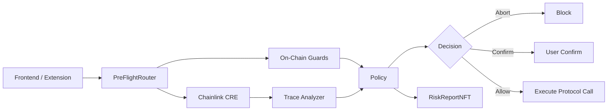
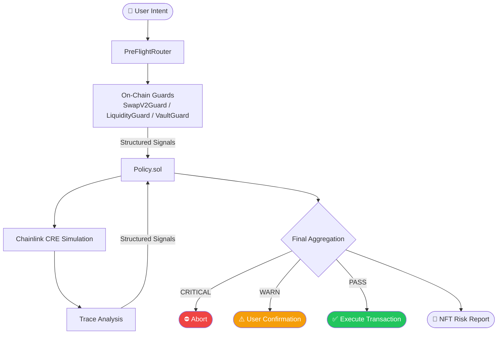
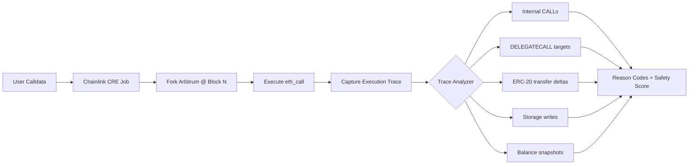
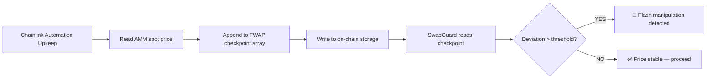
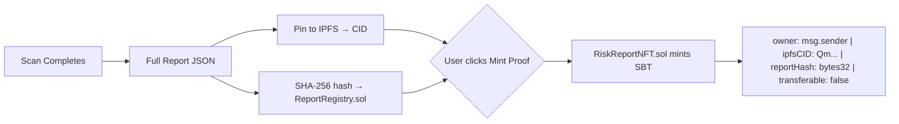

<div align="center">

# 🛡️ PreFlight

**Zero-Trust Pre-Transaction Firewall for Arbitrum DeFi**

*Verify before you execute. Trust nothing. Simulate everything.*

<br/>

[](https://arbitrum.io)
[](https://chain.link)
[](https://automation.chain.link)
[](https://soliditylang.org)
[](https://book.getfoundry.sh)
[](LICENSE)

<br/>

> Built for the **Arbitrium Infrastructure** — using Chainlink CRE for off-chain fork simulation and Chainlink Automation for real-time TWAP maintenance.

</div>

---

## Table of Contents

- [What is PreFlight?](#what-is-preflight)
- [The Problem](#the-problem)
- [Core Abstraction](#core-abstraction)
- [Architecture](#architecture)
- [How It Works](#how-it-works)
- [Chainlink Integration](#chainlink-integration)
- [Security Modules](#security-modules)
- [Risk Reports & Soulbound NFT](#risk-reports--soulbound-nft)
- [Design Principles](#design-principles)
- [Getting Started](#getting-started)
---

## What is PreFlight?

**PreFlight is a transaction-level integrity firewall that runs before your DeFi transaction executes.**

It is not a price oracle, or a monitoring dashboard. It is a **pre-execution verifier**: given exact calldata, exact block state, and exact user intent — it tells you whether that transaction is safe to submit. Every decision is explainable, reproducible, and backed by on-chain evidence.

Unlike price previews or slippage warnings, PreFlight:

- Executes the inbuilt on-chain guards
- Simulates the exact calldata
- Analyzes the execution trace
- Verifies accounting invariants
- Detects manipulation patterns
- Enforces explainable security policy
```
[ User Signs Intent ] ──► [ PreFlight Verification ] ──► [ Execute on Arbitrum ]
                                      ↕
                            Guards + CRE Simulation
                            + Trace Analysis + Policy
```

---

## The Problem

Users lose funds even when:

- UI preview looks correct  
- Slippage is reasonable  
- Protocol is audited  
- MEV protection is enabled  

Because:
- Flash-loan manipulation distorts state  
- Routers use hidden delegatecalls  
- Vault exchange rates are manipulated  
- Internal calls redirect funds
- Runtime state manipulation

** Existing tools only check math — not execution**  
***PreFlight checks execution integrity.***

PreFlight fills this gap. It operates between **sign** and **execute** — the only window these tools leave unguarded.

```js
[ Sign Transaction ] → [ PreFlight Verification ] → [ Execute ]
```

---

## Core Abstraction

A transaction is safe **if and only if**:

> *The observable on-chain state, execution trace, and accounting invariants match the user's intent within defined risk bounds.*

PreFlight enforces this across three independent layers:

| Layer | What It Verifies | How |
|---|---|---|
| **State Integrity** | On-chain state is not manipulated | Deterministic `view`-only Guard contracts |
| **Execution Integrity** | What *will* happen when the tx runs | Chainlink CRE forks Arbitrum and simulates |
| **Accounting Integrity** | Balance deltas match intent | Trace analysis + invariant math |

---


# Architecture

PreFlight enforces strict separation of concerns.



---

## System Layers

```
┌──────────────────────────┐
│        Frontend          │
│  - Intent Builder        │
│  - Risk Visualization    │
└─────────────┬────────────┘
              │
┌─────────────▼────────────┐
│     PreFlightRouter      │
└─────────────┬────────────┘
              │
┌─────────────▼────────────┐
│    On-Chain Guards       │
│  - SwapV2Guard           │
│  - LiquidityGuard        │
│  - VaultGuard            │
└─────────────┬────────────┘
              │
┌─────────────▼────────────┐
│     Chainlink CRE        │
│  - Fork block            │
│  - Execute calldata      │
│  - Capture trace         │
└─────────────┬────────────┘
              │
┌─────────────▼────────────┐
│        Policy.sol        │
│  - Signal aggregation    │
│  - Severity evaluation   │
│  - Decision logic        │
└─────────────┬────────────┘
              │
        Execute / Abort
              │
        RiskReportNFT
```

---

## How It Works

PreFlight enforces **transaction-level integrity verification** in four structured stages:



**Step 1 — On-chain Guards (Fast, Deterministic):** `PreFlightRouter` calls view functions on `SwapV2Guard`, `LiquidityGuard`, and `VaultGuard`. These are cheap, `view`-only reads against live on-chain state: TWAP deviation, reserve deltas, token mintability, exchange rate spikes etc. All the warning signals generated during checks , are passed to `Policy.sol` for final aggregation.

**Step 2 — Chainlink CRE Simulation (Deep Verification):** This works as an off-chain guard mechanism . After on-chain checks,  the transaction is forwarded to Chainlink CRE . CRE performs:
1. Fork Arbitrum at the current block  
2. Execute exact user calldata  
3. Capture full execution trace  
4. Compute balance deltas  
5. Analyze invariant violations  

Trace-level detections include:

- `DELEGATECALL` to unknown targets  
- `SELFDESTRUCT` in call path  
- Unexpected third-party transfers  
- Hidden approval escalations  
- Accounting inconsistencies  
- Donation / inflation patterns  

All simulation-derived signals are emitted in structured format and forwarded to `Policy.sol`.

**Step 3 — Decision Engine (Policy.sol):** `Policy.sol` is the single aggregation layer. It aggregates all structured signals based on severity, and confidence levels . these are then presented into a final report format — no black-box scoring.

**Step 4 — NFT Risk Report (Verifiable Evidence):** The final aggregated report is presented to user in NFT form . User gets the full analyses and has the option to whether to acknowledge the risks and proceed the transaction or revert the transaction .

---

## Chainlink Integration

PreFlight's depth is entirely powered by Chainlink infrastructure.

### Chainlink CRE — Off-Chain Transaction Simulation


Using CRE means simulation is **deterministic**, **attestable**, and not dependent on a centralized backend. Results can be referenced in on-chain decisions and embedded in NFT report metadata.

### Chainlink Automation — Real-Time TWAP Maintenance

`SwapV2Guard.spotVsTwap()` is the primary flash-loan detection mechanism. It compares spot price against a historical TWAP — which is only trustworthy if maintained by a reliable, trust-minimized keeper.


Automation runs the TWAP upkeep on a per-pool configurable interval — no centralized cron job, no trust assumption.

---

## Security Modules

PreFlight protects four DeFi actions on Arbitrum. Each has a defined threat model, invariants, and abort conditions.

### SwapV2Guard

| Check | Layer | Abort Condition |
|---|---|---|
| Canonical router | On-chain | Not in registry → CRITICAL |
| Spot vs TWAP | On-chain (Automation-fed) | >1% stable / >5% major pool → BLOCK |
| Reserve delta | On-chain | >10% change since last block → flash loan |
| Min liquidity | On-chain | TVL < $20k + trade > 1% TVL → BLOCK |
| Token mintability | On-chain | Owner-mintable detected → WARN |
| Simulated vs quoted output | CRE | Below slippage threshold → BLOCK |
| Fee-on-transfer | CRE Trace | Received < quoted → HIGH RISK |
| Third-party transfer | CRE Trace | Funds to unknown address → CRITICAL |
| Delegatecall to unknown | CRE Trace | Unknown target → CRITICAL |

### LiquidityGuard

| Check | Layer | Abort Condition |
|---|---|---|
| Token mintable | On-chain | Exposes mint/owner → WARN |
| Pair creation age | On-chain | < 1000 blocks old → WARN |
| Canonical router | On-chain | Not whitelisted → CRITICAL |
| Approval flow | CRE Trace | Approval to unexpected address → CRITICAL |
| LP mint destination | Backend | LP minted to unknown address → HIGH |
| Simulate add correctness | CRE | Tokens not credited to user → BLOCK |
| LP transfer restriction | On-chain | Honeypot LP detected → WARN |
| Withdrawal external calls | CRE Trace | Arbitrary call during exit → CRITICAL |

### VaultGuard (ERC-4626)

| Check | Layer | Abort Condition |
|---|---|---|
| Exchange rate delta | On-chain | >2% WARN / >10% BLOCK |
| Assets balance mismatch | On-chain | `balanceOf ≠ totalAssets` → CRITICAL |
| Total assets jump | On-chain | Jump without supply change → CRITICAL |
| Admin hook on deposit | CRE Trace | Admin function fires during user flow → CRITICAL |
| Withdraw path delegatecall | CRE Trace | Delegatecall during exit → CRITICAL |
| Simulate deposit shares | CRE | Shares received < expected → BLOCK |
| Reentrancy pattern | CRE Trace | Balance modified mid-flow → CRITICAL |

---

## Risk Reports & Soulbound NFT

Every scan can produce one **Soulbound NFT** — a tamper-proof, IPFS-linked proof of the pre-execution analysis. Minting is always opt-in and consent-gated.


One NFT per scan. Non-transferable. The report CID contains the full trace, all reason codes, and a Foundry reproduction script — making every block decision independently verifiable by auditors or judges.

---

## Design Principles

Every guard is `view`-only, deterministic, and maps to a canonical reason code. There are no magic scores, no auto-approvals, and no dark patterns. Heavy heuristics live in the CRE simulation layer — never on-chain.

The architecture is intentionally modular: adding a new protocol requires only a new adapter. Adding a new check requires only a new guard function. Nothing else changes. Every decision is defensible to a judge, auditor, or protocol team.

This is how production DeFi security infrastructure is built.

---

## Getting Started
```bash
# Clone and install
git clone https://github.com/Sourav-IIITBPL/preflight && cd preflight
forge install

# Run unit tests
forge test --match-path "test/unit/*" -vv

# Run Arbitrum fork tests
ARBITRUM_RPC=<your_rpc_url> forge test --match-path "test/fork/*" --fork-url $ARBITRUM_RPC -vv

# Deploy to Arbitrum Sepolia
forge script script/Deploy.s.sol --rpc-url $ARBITRUM_SEPOLIA_RPC --broadcast --verify

# Run backend
cd backend && cp .env.example .env && npm run dev
```

---


## License

MIT © PreFlight Contributors

---

<div align="center">

**Built with 🔗 Chainlink CRE · Chainlink Automation · Arbitrum · Foundry**

*PreFlight — Trust the math, not the preview.*

</div>
|

---

