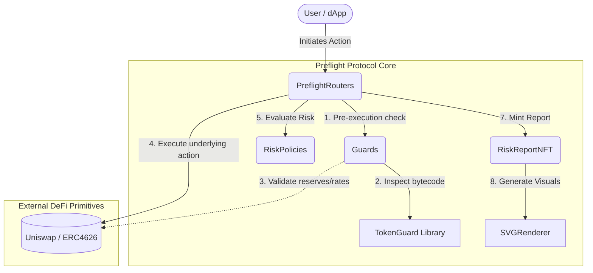

# Architecture Deep Dive

This document provides a highly technical breakdown of the Preflight Protocol's modules for auditors, dissecting the exact execution flow, bit-packing algorithms, and heuristic logic of each component.

## 1. System Module Relationships

The protocol modules interact systematically to provide end-to-end execution and assessment without permanently locking user funds.

## 2. Routers (`src/preflightRouters`)
The Router contracts act as orchestrators. 

### Execution Sequence Diagram

The following sequence illustrates the complete atomic flow of a `SwapV2Router.guardedSwapExactTokensForTokens` transaction:

```mermaid
sequenceDiagram
    participant U as User
    participant R as SwapV2Router
    participant G as SwapV2Guard
    participant TG as TokenGuard
    participant A as Uniswap V2 AMM
    participant P as SwapV2RiskPolicy
    participant N as RiskReportNFT
    
    U->>R: guardedSwapExactTokensForTokens()
    R->>G: validateSwapCheck(path, amountIn)
    
    rect rgb(30, 30, 30)
        Note over G,TG: Guard Pre-Execution Phase
        G->>TG: checkToken(token0 & token1)
        TG-->>G: TokenGuardResult (heuristics)
        G->>A: getReserves() & calculate expected TWAP
    end
    
    R->>A: SafeERC20 Transfer & execute swapExactTokensForTokens()
    A-->>R: returned amountsOut
    
    rect rgb(30, 30, 30)
        Note over R,P: Policy & NFT Execution Phase
        R->>G: storeSwapCheck(actualAmountOut)
        G-->>R: SwapV2GuardResult (Final State)
        R->>P: evaluate(offChainData, result)
        P-->>R: packedRiskReport (uint256 bitflags)
        R->>N: mint(packedRiskReport, user)
        N-->>U: Issue ERC721 NFT Receipt
    end
    
    R-->>U: Return Swap Amounts & Finish
```

*Security Assumption*: Routers are protected by OpenZeppelin's `ReentrancyGuard` and only hold funds transiently within the scope of a single transaction. Remaining balances can be rescued via `onlyOwner` functions.

## 3. Guards & TokenGuard (`src/guards`)
Guards contain the heaviest logic of the protocol. They are stateful and interface heavily with `TokenGuard`.

### `TokenGuard.sol`
A completely view-only heuristic engine that directly inspects ERC20 bytecode without relying on external oracles or test transactions.
- **Proxy Detection**: Manually reads EIP-1967 (`0x360894a13ba1a3210667c828492db98dca3e2076cc3735a920a3ca505d382bbc`) and EIP-1822 (`0xc5f16f0fcc639fa48a6947836d9850f504798523bf8c9a3a87d5876cf622bcf7`) storage slots using inline-assembly static calls. Identifies EIP-1167 Minimal Clones by inspecting the first 10 bytes of deployed bytecode.
- **Selector Scanning**: Employs EVM assembly to loop through token bytecode up to the 24KB limit, searching for matching 4-byte function signatures that indicate:
  - Fee-On-Transfer (`transferFee() -> 0xf3b7b24e`, `_taxFee() -> 0x4355b9fe`)
  - Rebasing mechanisms (`rebase() -> 0x99a0c2b8`, `gonsPerFragment() -> 0x5bc22ff8`)
  - Blacklisting capabilities (`isBlacklisted(address) -> 0xe47d6060`)
- *Auditor Note*: We acknowledge that `TokenGuard` uses heuristics. A malicious token could obscure its fee logic using fallback functions or non-standard signatures, leading to false negatives. This is an accepted protocol limitation.

### `SwapV2Guard.sol` & `LiquidityV2Guard.sol`
- Fetch reserves from Uniswap V2 pairs.
- Enforce the Constant Product Invariant ($x * y = k$).
- Query the `price0CumulativeLast` and `price1CumulativeLast` variables to calculate the Time-Weighted Average Price (TWAP) and detect immediate flashloan manipulation.

### `ERC4626VaultGuard.sol`
- Mitigates common Vault exploits. 
- Analyzes `totalAssets()` vs real ERC20 balance to detect **Donation Attacks** (where an attacker donates assets to artificially inflate the share price) or **Share Inflation Attacks**.
- Validates that preview functions (`previewDeposit`) tightly match execution functions (`convertToShares`) within an accepted basis point tolerance.

## 4. Risk Policies & Bit-Packing Algorithms (`src/riskpolicies`)
The policies are completely stateless mathematical evaluators. Because passing dozens of boolean flags to an NFT contract would be catastrophically expensive in gas, the `RiskPolicy` employs aggressive bit-packing.

### Bitwise Packing Structure (`SwapV2RiskPolicy`)
The policy maps `SwapV2GuardResult` fields into specific bit indices of a `uint32 onChainFlagsPacked` mapping:
- Bit 0: `FLAG_ROUTER_NOT_TRUSTED`
- Bit 3: `FLAG_DUPLICATE_TOKEN_IN_PATH`
- Bit 6: `FLAG_ZERO_LIQUIDITY`
- Bit 11: `FLAG_K_INVARIANT_BROKEN`
- Bit 14: `FLAG_PRICE_MANIPULATED`

These grouped uint32 flags, alongside critical counts and economic data (like price impact in basis points), are then shifted and merged via bitwise `|` operators into a singular `uint256 packedReport`. This guarantees that the `RiskReportNFT` can store the entire complex security analysis using exactly one SSTORE operation.

## 5. NFT & SVG Rendering Engine (`src/nftReport`)
- **RiskReportNFT.sol**: A standard ERC721 token. Minting is heavily restricted to authorized Routers via the `onlySourceMinter` modifier. 
- **SVGLib.sol & SVGRenderer.sol**: A highly gas-optimized, fragmented library system designed explicitly to bypass the EIP-170 24KB contract size limit. The renderer parses the `uint256 packedReport` using bitwise `&` masks, dynamically translating flags like `FLAG_K_INVARIANT_BROKEN` into colored `<text>` and `<rect>` SVG warning nodes within the DOM. This results in a vivid, on-chain graphical representation of the transaction's safety score, without any IPFS or centralized server dependencies.
