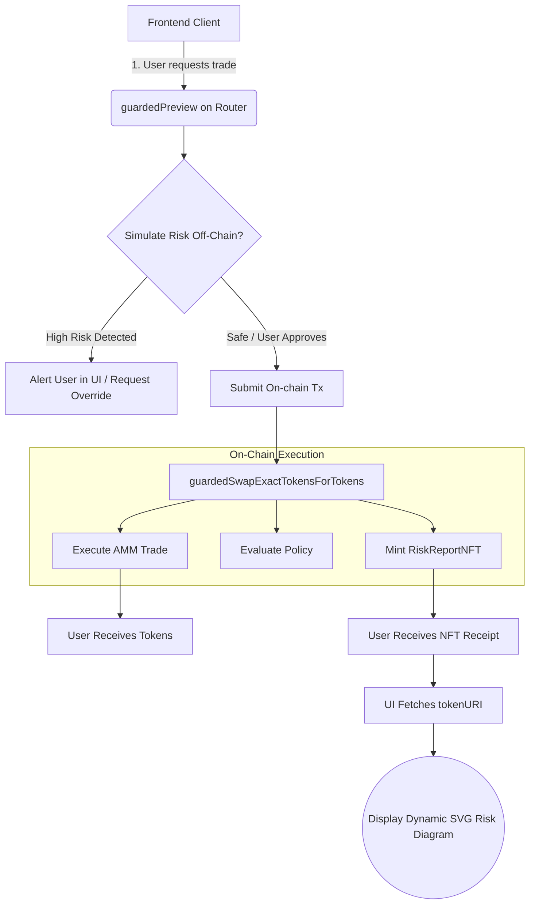

# Integration & Developer Guide

This document is intended for dApp developers, frontends, and auditors looking to understand how Preflight interacts with external protocols and how the data flows through the system.

## 1. System Integration Flow

Preflight operates identically to standard interfaces but introduces a `guarded` nomenclature. Instead of directly calling the DeFi primitive, dApps route through Preflight to get an atomic risk assessment alongside their transaction.

### Frontend Integration Lifecycle



## 2. Interfacing with Risk Reports (On-chain)

Third-party smart contracts can decode the risk report programmatically to implement their own circuit breakers.

When a swap occurs, the `packedRiskReport` (`uint256`) is returned. Contracts can utilize the policy to decode this:

```solidity
// Import the Policy Interface
import {ISwapV2RiskPolicy, SwapV2DecodedRiskReport} from "preflight/riskpolicies/SwapV2RiskPolicy.sol";

// Execute guarded swap
(uint256[] memory amounts, uint256 packedRiskReport) = router.guardedSwapExactTokensForTokens(...);

// Decode the raw integer into an accessible struct
SwapV2DecodedRiskReport memory report = ISwapV2RiskPolicy(policyAddress).decode(packedRiskReport);

// Circuit breaker logic based on Preflight's heuristics
if (report.hasTransferFeeGetter || report.possibleRebasing) {
    revert("Preflight: High Risk Token Detected");
}
if (report.excessiveSlippage) {
    revert("Preflight: Slippage exceeds protocol safety bounds");
}
```

## 3. Frontend Integration (Off-chain)

Frontends can simulate a transaction without executing it to preview the Risk Report.

```solidity
(SwapV2GuardResult memory result, uint256 expectedOut) = 
    SwapV2Router.guardedPreview(ammRouter, path, true, amountIn);
```

Frontends can also fetch the dynamically rendered SVG image of past transactions directly from the blockchain via RPC:

```javascript
// Example using ethers.js
const tokenURI = await RiskReportNFT.tokenURI(tokenId);

// Returns: data:application/json;base64,...
// Contains: { 
//   "name": "PreFlight Risk Report #...", 
//   "description": "...", 
//   "image": "data:image/svg+xml;base64,..." 
// }
```

## 4. Supported AMMs and Vaults
Preflight is intentionally highly specific to its integrations:

- **Uniswap V2 Clones**: Supports `UniswapV2Router02` architectures (Uniswap V2, Sushiswap V2, Pancakeswap V2).
- **ERC-4626 Vaults**: Supports standard yield-bearing vaults conforming precisely to EIP-4626. Custom non-standard vaults that deviate from `totalAssets()` or `convertToShares()` behaviors will flag as extremely high risk and may revert during guard checks.
