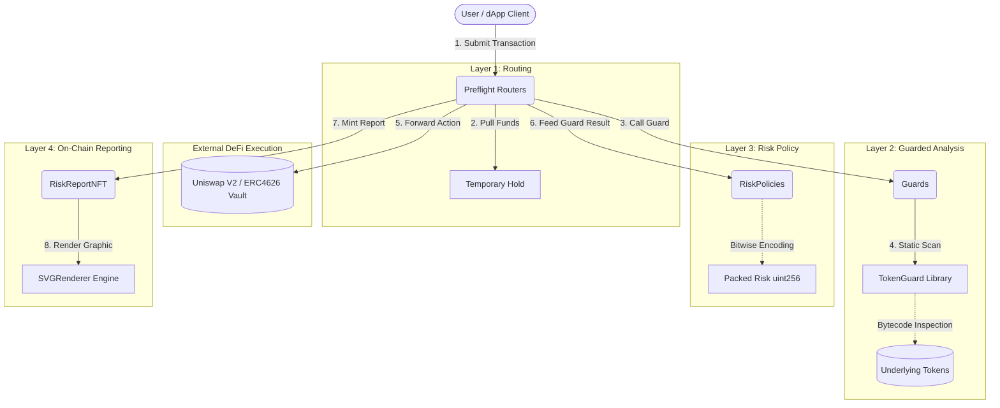

# PreFlight Protocol: Comprehensive Audit Documentation

## 1. Executive Summary
PreFlight is a pioneering pre-transaction security and risk assessment system explicitly engineered for Decentralized Finance (DeFi) platforms. In the modern DeFi landscape, users interact with Automated Market Makers (AMMs) and Yield Vaults with minimal insight into the real-time, under-the-hood risks of their transactions—such as hidden token taxes, impending honeypots, malicious proxies, or severe pool imbalances.

The **PreFlight Protocol** solves this by wrapping standard DeFi actions inside a "Guarded Execution Flow". Instead of sending a transaction directly to a Uniswap V2 Router or an ERC-4626 Vault, users route their transaction through a PreFlight Router. PreFlight then:
1. **Snapshots** the pre-state of the AMM/Vault.
2. **Analyzes** the underlying ERC-20 tokens via static bytecode heuristics (`TokenGuard`).
3. **Executes** the underlying action on behalf of the user securely.
4. **Validates** the post-state (e.g., verifying the $x * y = k$ invariant).
5. **Evaluates** a stateless Risk Policy that bit-packs the findings into a highly compressed Risk Report payload.
6. **Mints** a dynamically generated, 100% on-chain SVG NFT containing the Risk Report to the user as an immutable receipt of execution safety.

---

## 2. The Problem PreFlight Solves

### The Information Asymmetry in DeFi
1. **Malicious Tokens**: Scam tokens frequently implement dynamic `Fee-On-Transfer` taxes, or blacklist users post-purchase. Standard AMM routers process these swaps blindly, resulting in users receiving significantly fewer tokens than expected, or buying tokens they can never sell.
2. **Vault Exploits (ERC-4626)**: A common attack vector against Yield Vaults is the "Donation Attack" (or "Inflation Attack"), where an attacker donates assets to an empty vault to artificially inflate the share price, frontrunning a victim's deposit and stealing their funds due to rounding errors.
3. **Impermanent Loss & AMM Imbalance**: New or heavily manipulated liquidity pools often suffer from extreme price divergence or "K-invariant" violations.

### The PreFlight Solution
PreFlight acts as an automated, non-custodial auditor sitting natively in the transaction path. By integrating PreFlight, wallets and dApps can offer users "Guarded Swaps" and "Guarded Deposits" that actively detect, mitigate, or flag these exploits in real-time.

---

## 3. High-Level Architecture Overview

PreFlight separates concerns across four highly specialized smart contract layers. This modularity ensures that the heavy algorithmic lifting of risk analysis does not bloat the routers handling user funds.

### Layer Breakdown

#### A. The Routing Layer (`PreflightRouters`)
The public-facing contracts mapping exactly to standard interfaces.
- **Contracts**: `ERC4626Router.sol`, `SwapV2Router.sol`, `LiquidityV2Router.sol`
- **Role**: They act as strict transaction orchestrators. They hold no custody of user funds between transactions. They execute `ExactTokensForTokens` or `Deposit/Mint` actions by interacting with the underlying AMMs/Vaults, sandwiching the call with Guard and Policy evaluations.

#### B. The Guard Layer (`Guards`)
The analytical engine of the protocol.
- **Contracts**: `SwapV2Guard.sol`, `ERC4626VaultGuard.sol`, `LiquidityV2Guard.sol`, `TokenGuard.sol`
- **Role**: They run pre-execution checks (snapshotting balances, fetching pool reserves) and post-execution invariant checks (verifying the `k` invariant in AMMs or vault share/asset ratios). The `TokenGuard` library is extensively utilized here to dissect raw EVM bytecode for anomalies.

#### C. The Policy Layer (`RiskPolicies`)
Stateless evaluators mapping technical flags to severity levels.
- **Contracts**: `SwapV2RiskPolicy.sol`, `ERC4626RiskPolicy.sol`, `LiquidityV2RiskPolicy.sol`
- **Role**: Takes the pre- and post-execution data from the Guards and compiles them into a `RiskReport`. It assigns risk flags based on predefined conditions (e.g., severe slippage, token anomalies, balance anomalies) and compresses them using bit-packing into a single `uint256`.

#### D. The NFT & Rendering Layer (`nftReport`)
The immutable audit trail and visualization engine.
- **Contracts**: `RiskReportNFT.sol`, `SVGRenderer.sol`, `SVGLib.sol`
- **Role**: Once the Risk Policy returns the encoded risk report, the Router mints an ERC721 token to the user. When queried via `tokenURI`, the NFT invokes the `SVGRenderer`, which decodes the bit-packed flags and dynamically generates a highly detailed, colored SVG diagram entirely within the EVM.

---

## 4. Key Terminology for Auditors

To accurately review the codebase, auditors must familiarize themselves with the following PreFlight-specific terms:

- **Guard Result (`GuardResult`)**: An in-memory struct containing the raw pre- and post-execution state of an AMM/Vault, generated by a Guard. It contains dozens of boolean flags (e.g., `DONATION_ATTACK`, `K_INVARIANT_BROKEN`).
- **Packed Risk Report (`uint256 packedReport`)**: To save gas during NFT minting, the Risk Policy compresses all boolean flags, critical counts, and economic data into a single 256-bit integer using bitwise shifts. This integer is stored permanently in the NFT contract.
- **TokenGuard**: A robust, static-analysis view library that reads bytecode directly from ERC20 tokens using inline assembly. It heuristically detects tax patterns, proxies, blacklists, and mint/burn functionality without simulating transfers.

---

## 5. Security & Trust Assumptions

PreFlight assumes the following regarding trust and access control:
1. **Router Transient Custody**: Funds are only held in the Router for the duration of the transaction. Any failure strictly reverts the transaction.
2. **Owner Centralization**: The protocol utilizes `Ownable` contracts. The owner can redirect Guards, Policies, and NFT renderers. This centralization is an acknowledged, accepted risk and is **OUT OF SCOPE** for exploit reporting.
3. **Heuristic Limitations**: `TokenGuard` relies on identifying 4-byte function selectors within deployed bytecode. Malicious actors could obfuscate their bytecode to bypass these checks. False negatives (missing a tax) and false positives (flagging a safe token) are known and accepted limitations of static EVM analysis.

*Please refer to `THREAT_MODEL.md` and `ARCHITECTURE.md` for deeper technical invariants and out-of-scope definitions.*
