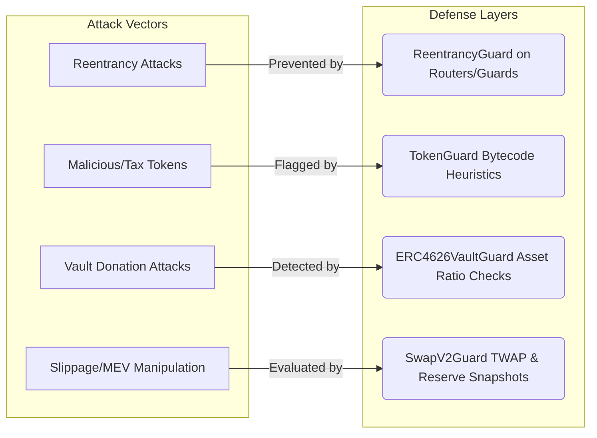

# Threat Model & Security Posture

This Threat Model defines the exact security assumptions, access controls, invariant definitions, and accepted risks within the Preflight Risk Management Protocol. Auditors should base their vulnerability classifications on these definitions.

## 1. Threat Mitigation Mapping

The protocol utilizes a multi-layered defense to prevent exploits while executing interactions.

## 2. Access Control Matrix

| Contract | Role | Capability | Risk if Compromised |
|----------|------|------------|---------------------|
| `PreflightRouters` | `owner` | Can update Guard, RiskPolicy, and NFT addresses. Can execute `rescueERC20` and `rescueETH`. | **High**: Can steal trapped funds. Can redirect protocol flow to malicious guards. *(Considered Out of Scope for exploits)* |
| `Guards` | `owner` | Can update `TokenGuard` address and internal snapshot intervals. | **Medium**: Can brick the Guard checks or loosen security heuristics. |
| `RiskReportNFT` | `owner` | Can set `sourceMinters` (Routers permitted to mint). | **Low-Medium**: Could allow arbitrary minting of NFTs, diluting audit trails. |

> **IMPORTANT**: Centralization risks related to `onlyOwner` are known and **OUT OF SCOPE**. Please do not report findings detailing "Owner can rescue funds" or "Owner can change Risk Policy".

## 3. Core Protocol Invariants

The protocol is designed around the following strict invariants. Any mechanism to bypass or break these invariants is considered a valid finding.

1. **Transient Custody**: Routers must never persistently custody user funds. Funds enter the Router during `guardedSwap...` and must exit entirely to the receiver, the AMM, or be refunded to the user within the same transaction.
2. **Atomic Report Minting**: An execution through the Router *must* result in the creation of exactly one Risk Report NFT containing the accurate, untampered data of that specific transaction.
3. **Accurate Guard Validation**: `TokenGuard` must successfully evaluate a standard, non-malicious ERC20 token without reverting. Reverts triggered by malicious tokens or out-of-gas errors due to extreme token bytecode sizes are acceptable.
4. **SVG Integrity**: Calling `tokenURI()` on the NFT contract must return a valid base64-encoded SVG and JSON payload. It must not revert or fail due to block gas limits under normal risk-flag conditions.

## 4. Accepted Risks / Known Issues (OUT OF SCOPE)

The following architectural limitations are acknowledged by the team and are **not** eligible for bounty/reporting unless they lead to a direct loss of funds or break an invariant outside their intended scope:

- **False Negatives in `TokenGuard`**: The heuristic scanning of contract bytecode for function selectors (e.g., `0xf3b7b24e` for `transferFee()`) can be bypassed if a malicious token obfuscates its functions or uses non-standard signatures. This is an accepted limitation of static bytecode analysis.
- **False Positives in `TokenGuard`**: Random bytecode data may coincidentally match a 4-byte selector, triggering a false positive risk flag.
- **Gas Intensive Executions**: Given the heavy reliance on `extcodecopy` and assembly scanning, transactions routed through Preflight will consume significantly more gas than standard Uniswap/Vault interactions.
- **Fee-On-Transfer/Rebasing AMM Reverts**: If a user attempts an exact-output swap with a fee-on-transfer token, the underlying AMM will revert. Preflight does not wrap custom logic to force fee-on-transfer success on standard V2 Routers.
- **EIP-1167 / Proxies without Standard Slots**: `TokenGuard` checks standard EIP-1967 and EIP-1822 storage slots. Custom proxies utilizing non-standard storage slots for their implementations will be falsely identified as non-proxies.
